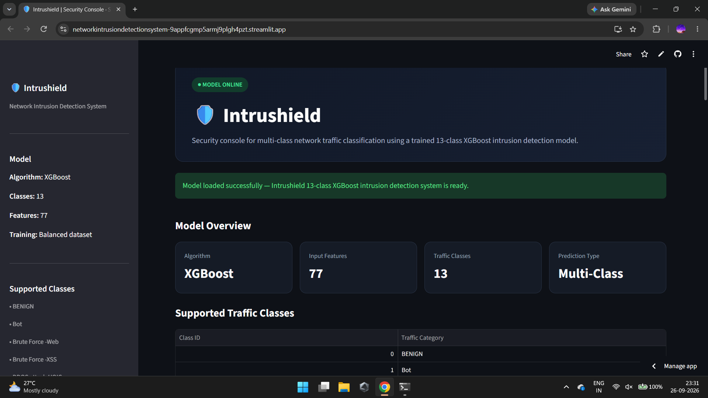
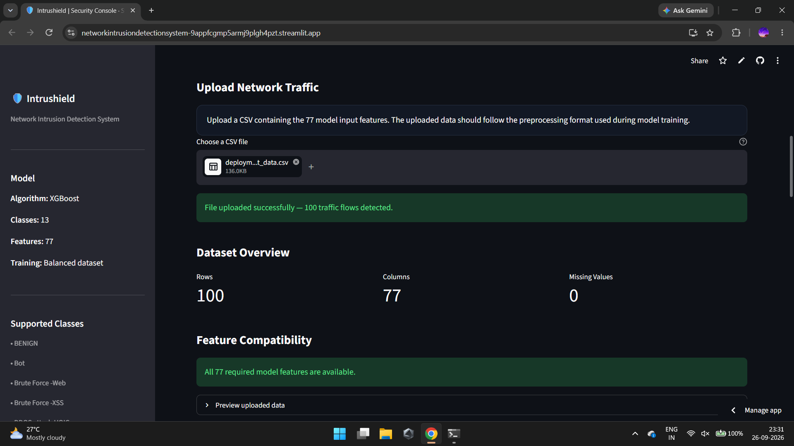
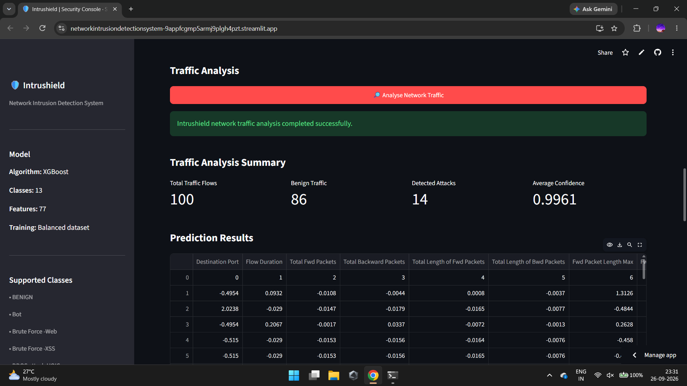
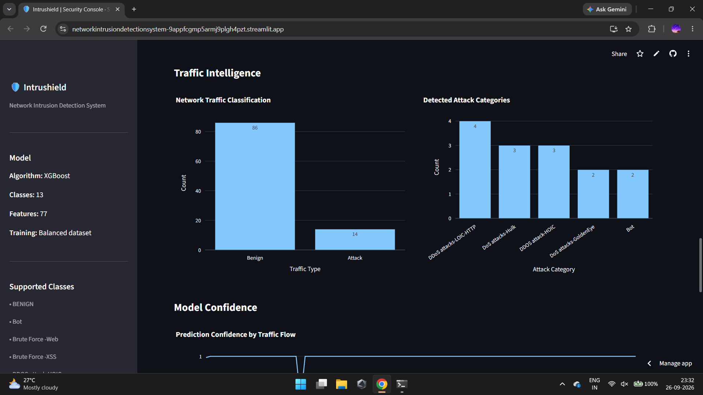
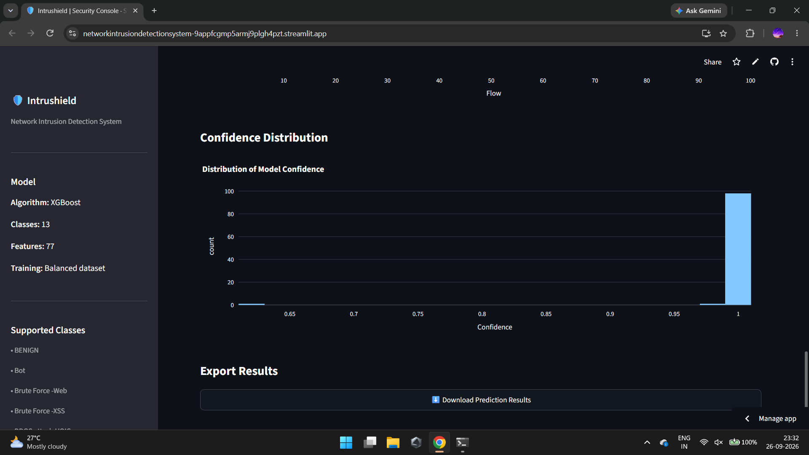

# Network Intrusion Detection System — CICIDS2017 + CICIDS2018

Classifying network traffic flows as BENIGN or one of 12 real attack categories, using a multiclass XGBoost model trained on 12M+ real network flow records — combining and reconciling two full years of CIC's benchmark intrusion datasets.

## Problem Statement

**Enterprise networks generate massive volumes of traffic that must be continuously screened for malicious activity — but naive classifiers trained on imbalanced intrusion data can achieve deceptively high accuracy simply by predicting "normal traffic" for everything, missing real attacks entirely. This project builds a multiclass network intrusion classifier on real CICIDS2017/2018 flow data, explicitly validating against this exact failure mode (model collapse toward the dominant BENIGN class) rather than trusting a single accuracy number.**

## Dataset

- **Source:** CICIDS2017 + CICIDS2018 (Canadian Institute for Cybersecurity) — official benchmark network intrusion datasets, merged and reconciled, not used as separate isolated sources
- **Scale:** Millions of network flow records across both years, 77 network flow features per record (duration, packet/byte counts, TCP flag counts, inter-arrival times, active/idle statistics)
- **Classes:** 13 total — BENIGN plus 12 real attack categories (Bot, Brute Force-Web, Brute Force-XSS, DDoS attack-HOIC, DDoS attack-LOIC-UDP, DDoS attacks-Generic, DDoS attacks-LOIC-HTTP, DoS attacks-GoldenEye, DoS attacks-Hulk, DoS attacks-SlowHTTPTest, DoS attacks-Slowloris, FTP-BruteForce)

## Approach

1. **ETL Pipeline** — extracted raw CICIDS2017/2018 CSVs, avoided loading the full multi-gigabyte combined dataset into memory blindly after repeated kernel crashes/freezes during early attempts
2. **Schema Reconciliation** — standardized column names and feature schema across the two dataset years (2017 and 2018 use different naming conventions for the same underlying features)
3. **Cleaning** — handled `NaN` and `Infinity` values, a known artifact of CICFlowMeter's rate-based feature calculations (division by near-zero flow durations)
4. **The 19-class → 13-class decision** — the raw combined dataset initially encoded 19 distinct classes, but several had as few as 9, 29, and 85 total samples — far too small to learn reliably. Rather than force an unreliable 19-way classifier, the unsupported/extremely rare classes were deliberately excluded, producing a genuinely learnable 13-class configuration
5. **Capped Sampling Strategy** — BENIGN traffic (11.5M+ available samples) was capped at 100,000 sampled rows to prevent total dominance of the training set, while small attack classes retained every available sample (e.g. a class with only 1,632 samples kept all 1,632) — final training set: 666,515 samples across 13 classes
6. **Leakage-Safe Split** — model evaluated exclusively on a held-out test set (3,205,990 samples) never seen during training, with feature order explicitly verified to match training exactly before any prediction
7. **Model Collapse Validation** — explicitly checked whether the model had simply learned to predict BENIGN for everything (a real risk given the imbalance) by confirming predictions actually spanned all 13 classes, not just the majority one
8. **Deployment** — Streamlit app accepting user-uploaded CSVs, validating required features are present before attempting prediction, with prediction confidence and downloadable results

## Why XGBoost Was Selected

After comparing the three candidate models, XGBoost was selected as the final model architecture.
The selection was not based solely on overall accuracy.
This was particularly important because the intrusion dataset was severely imbalanced. A model could achieve extremely high accuracy simply by predicting the dominant BENIGN class too frequently.

Therefore, the final model selection process considered:

Overall accuracy
Balanced accuracy
Precision
Recall
F1-score
Per-class performance
Confusion matrix behaviour
Ability to identify minority attack classes

The project roadmap explicitly identified XGBoost as a strong candidate for this structured network intrusion dataset and required the three models to be compared using imbalance-aware evaluation metrics rather than raw accuracy alone.

## Key Results

| Metric | Result |
|---|---|
| Overall Accuracy | 99.82% |
| Balanced Accuracy | 94.70% |
| Macro F1 Score | 86.22% |
| Test Samples (held-out) | 3,205,990 |
| Training Samples | 666,515 |
| Input Features | 77 |
| Classes | 13 |

**Why balanced accuracy and macro F1 are reported alongside overall accuracy:** with BENIGN traffic dominating the real-world distribution, overall accuracy alone can be misleadingly high even for a model that fails on rare attacks. Balanced accuracy and macro F1 weight every class equally, giving an honest read of minority-class performance.

**Per-class recall — strong on major categories, honestly weaker on the rarest:**

| Class | Recall |
|---|---|
| DDoS attacks-Generic | 99.99% |
| DoS attacks-GoldenEye | 99.99% |
| DDOS attack-HOIC | 99.98% |
| DoS attacks-Hulk | 99.98% |
| Bot | 99.97% |
| DDoS attacks-LOIC-HTTP | 99.91% |
| BENIGN | 99.82% |
| Brute Force-Web | 83.09% |
| Brute Force-XSS | 54.55% |

The two weakest classes (Brute Force-Web, Brute Force-XSS) are also the ones with the fewest available training/test examples — a direct, honest consequence of real-world class rarity, not a modeling flaw to hide.

## Model Collapse Check — Verified, Not Assumed

Given BENIGN's overwhelming majority in the raw data, a real risk was the model simply learning to predict BENIGN regardless of input. Explicit validation on the full held-out test set:

- **Total predictions:** 3,205,990
- **BENIGN predictions:** 2,875,080
- **Non-BENIGN predictions:** 330,910
- **Unique classes predicted:** all 13

Confirms the model genuinely distinguishes attack types rather than defaulting to the majority class — a validation step that directly addresses the core risk flagged in the Problem Statement above.

## How to Run

```bash
git clone <your-repo-url>
cd Network-Intrusion-Detection-System

conda create -n nids python=3.10 -y
conda activate nids
pip install -r requirements.txt

jupyter notebook notebooks/
streamlit run app/app.py
```

**Note on data:** raw CICIDS2017/2018 CSVs are not included in this repo (large files, excluded via `.gitignore`) — download from the official CIC sources and place in `data/raw_2017/` and `data/raw_2018/` before running the notebooks. The 3 trained model files (`.joblib`) are included in the repo and are all the deployed Streamlit app needs to run.

## Live Demo

🔗 [Try the app here](https://networkintrusiondetectionsystem-9appfcgmp5armj9plgh4pzt.streamlit.app/)

Upload a compatible network traffic CSV to get per-flow classification, confidence scores, attack distribution analysis, and downloadable results. The app validates that all 77 required features are present before predicting, and works even on partial uploads (e.g. BENIGN-only, or a single attack type).

## Limitations

- Rare attack classes (Brute Force-Web, Brute Force-XSS) have limited training examples and correspondingly weaker recall
- The deployed model expects the exact 77-feature CICFlowMeter schema used during training — an unrelated traffic format cannot be meaningfully classified
- Evaluated on held-out CICIDS-based data; real-world network performance may differ from this benchmark

## Screenshots







## Tech Stack

Python · Pandas · NumPy · Scikit-learn · XGBoost · Joblib · Streamlit · Jupyter · Git · GitHub
