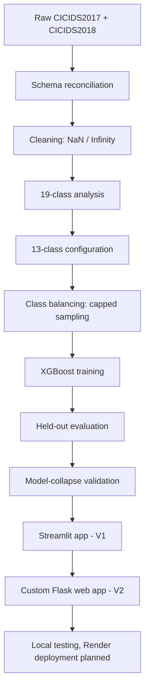
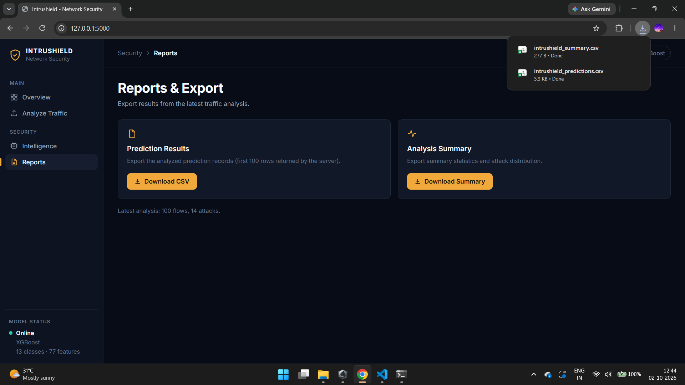

# Intrushield — Network Intrusion Detection System

Classifying network traffic flows as BENIGN or one of 12 attack categories, using a multiclass XGBoost model trained on CICIDS2017 + CICIDS2018 network flow data, combining and reconciling two years of CIC's benchmark intrusion datasets. It ships with two interfaces: a Streamlit app (V1) and a custom Flask + HTML/CSS/JavaScript web app (V2) which serves as the main app.

| Component | Details |
|---|---|
| Dataset | CICIDS2017 + CICIDS2018 |
| Model | XGBoost (multiclass) |
| Classes | 13 (BENIGN + 12 attacks) |
| Features | 77 |
| Training samples | 666,515 |
| Held-out test samples | 3,205,990 |
| V1 | Streamlit |
| V2 (main app) | Flask + HTML/CSS/vanilla JavaScript |

## Problem Statement

**Enterprise networks generate massive volumes of traffic that must be screened for malicious activity, but classifiers trained on imbalanced intrusion data can reach deceptively high accuracy simply by predicting "normal traffic" for almost everything, missing real attacks. This project builds a multiclass network intrusion classifier on CICIDS2017/2018 flow data and explicitly tests for this failure mode (model collapse toward the dominant BENIGN class) rather than trusting a single accuracy number.**

> Intrushield analyzes **uploaded, recorded network-flow CSV files** (offline analysis). It does not capture live packets and is not a production IDS.

## Dataset

- **Source:** CICIDS2017 + CICIDS2018 (Canadian Institute for Cybersecurity), benchmark network intrusion datasets, merged and reconciled rather than used as two isolated sources
- **Scale:** Millions of network flow records across both years, with 77 network-flow features per record (flow duration, packet/byte counts, TCP flag counts, inter-arrival statistics, active/idle statistics)
- **Classes:** 13 total, BENIGN plus 12 attack categories

| ID | Class | | ID | Class |
|---:|---|---|---:|---|
| 0 | BENIGN | | 7 | DDoS attacks-LOIC-HTTP |
| 1 | Bot | | 8 | DoS attacks-GoldenEye |
| 2 | Brute Force -Web | | 9 | DoS attacks-Hulk |
| 3 | Brute Force -XSS | | 10 | DoS attacks-SlowHTTPTest |
| 4 | DDOS attack-HOIC | | 11 | DoS attacks-Slowloris |
| 5 | DDOS attack-LOIC-UDP | | 12 | FTP-BruteForce |
| 6 | DDoS attacks-Generic | | | |

## Approach



1. **ETL Pipeline:** extracted the raw CICIDS2017/2018 files, avoiding loading the full multi-gigabyte combined data into memory at once after kernel crashes and freezes in early attempts
2. **Schema Reconciliation:** standardized column names and the feature schema across the two dataset years
3. **Cleaning:** handled `NaN` and `Infinity` values, a known artifact of CICFlowMeter's rate-based features (division by near-zero flow durations)
4. **The 19-class → 13-class decision:** the raw combined data initially had 19 classes, but several had as few as 9, 29 and 85 samples. The available representation of those categories was too limited to support a reliable multiclass setup in this project, so rather than force an unreliable 19-way classifier, the final model uses 13 classes
5. **Capped Sampling Strategy:** abundant classes were capped at 100,000 samples, while small classes kept every available sample. Final training set: **666,515 samples, 77 features, 13 classes**

| Class | Selected / Available |
|---|---:|
| BENIGN | 100,000 / 11,521,130 |
| Bot | 100,000 / 117,929 |
| Brute Force -Web | 1,632 / 1,632 |
| Brute Force -XSS | 705 / 705 |
| DDOS attack-HOIC | 100,000 / 219,920 |
| DDOS attack-LOIC-UDP | 1,384 / 1,384 |
| DDoS attacks-Generic | 100,000 / 102,413 |
| DDoS attacks-LOIC-HTTP | 100,000 / 460,645 |
| DoS attacks-GoldenEye | 41,353 / 41,353 |
| DoS attacks-Hulk | 100,000 / 335,401 |
| DoS attacks-SlowHTTPTest | 4,305 / 4,305 |
| DoS attacks-Slowloris | 12,278 / 12,278 |
| FTP-BruteForce | 4,858 / 4,858 |

6. **Held-Out Evaluation:** the model was evaluated on a separate test set of 3,205,990 samples not used for training, with feature count and order explicitly checked against the model's expected 77-feature schema before prediction. This is a held-out test evaluation, not cross-validation
7. **Model Collapse Validation:** explicitly checked whether the model had simply learned to predict BENIGN for everything (a real risk given the imbalance)
8. **Deployment:** a Streamlit app (V1), then a custom Flask web app (V2), both tested locally. Render deployment is planned

## Why XGBoost Was Selected

Three candidate models were compared, and XGBoost was selected as the final model. The selection was not based on overall accuracy alone, which matters here because a model can score extremely high accuracy just by predicting the dominant BENIGN class too often.

The comparison considered:

- Overall accuracy
- Balanced accuracy
- Precision, recall and F1-score
- Per-class performance
- Confusion matrix behavior
- Ability to identify minority attack classes

This was a project-specific choice on this dataset, not a claim that XGBoost is universally better than other models.

## Key Results

Evaluated on the **3,205,990-sample held-out test set**:

| Metric | Result |
|---|---:|
| Overall Accuracy | 99.8249% |
| Balanced Accuracy | 94.7028% |
| Macro Precision | 83.0271% |
| Macro Recall | 94.7028% |
| Macro F1 Score | 86.2216% |
| Weighted F1 Score | 99.8489% |
| Correct / Incorrect Predictions | 3,200,376 / 5,614 |
| Training Samples | 666,515 |
| Input Features | 77 |
| Classes | 13 |

**Why balanced accuracy and macro metrics are reported alongside overall accuracy:** BENIGN dominates the data, so overall accuracy and weighted F1 can look excellent even when rare attacks are missed. Balanced accuracy and macro metrics weight every class equally. The gap between overall accuracy (99.82%) and macro F1 (86.22%) shows that performance is not uniform across classes.

**Per-class recall: strong on major categories, weaker on the rarest:**

| Class | Recall |
|---|---:|
| DDoS attacks-Generic | 99.99% |
| DoS attacks-GoldenEye | 99.99% |
| DDOS attack-HOIC | 99.98% |
| DoS attacks-Hulk | 99.98% |
| Bot | 99.97% |
| DDoS attacks-LOIC-HTTP | 99.91% |
| BENIGN | 99.82% |
| Brute Force-Web | 83.09% |
| Brute Force-XSS | 54.55% |

The two weakest classes (Brute Force-Web and Brute Force-XSS) are also the ones with the fewest available examples (1,632 and 705). Their lower recall is consistent with the effect of limited class representation, though this may not be the only factor. These two numbers should not be read as reliable real-world performance.

## Model Collapse Check: Verified, Not Assumed

Given BENIGN's majority in the raw data, a real risk was the model learning to predict BENIGN regardless of input. Validation on the full held-out test set:

- **Total predictions:** 3,205,990
- **BENIGN predictions:** 2,875,080
- **Non-BENIGN predictions:** 330,910
- **Unique classes predicted:** all 13

This confirms that, on this held-out evaluation, the model did not collapse to a single predicted class and all 13 classes appeared in its predictions. It does not show that the model is perfect, unbiased, or ready for production.

## Applications

Both apps load the same three model artifacts from `models/`:

| File | Purpose |
|---|---|
| `xgboost_attack_model_13class_balanced.joblib` | The trained XGBoost model |
| `xgboost_attack_model_13class_features.joblib` | The 77 feature names, in the order the model expects |
| `xgboost_attack_model_13class_mapping.joblib` | The class mapping (class ID to label) |

### V2: Flask + HTML/CSS/vanilla JavaScript (main app)

A custom web interface served by one Flask process. It uses no frontend framework, no Node.js and no build step.

**Features:**
- Security Overview with KPIs (Total Flows, Benign Traffic, Detected Attacks, Average Confidence)
- Traffic Overview, Threat Distribution and Recent Predictions
- Detection Engine information and Detection Coverage of the 13 classes
- Drag-and-drop CSV upload with a feature-compatibility check
- Reports & Export: downloadable prediction results and analysis summary

**How it works:** the browser sends the CSV to Flask's `/predict` endpoint as a multipart form upload with the field name `file`. The backend then:

1. Validates that a CSV was provided and that all required features are present
2. Selects the model's exact feature order (extra columns are ignored)
3. Converts values to numeric form and handles invalid numeric values
4. Predicts in chunks and calculates confidence for each prediction
5. Returns summary counts, the class distribution and a limited number of per-row predictions as JSON

The backend also exposes `/health` and `/model-info`.

### V1: Streamlit application

The original app: CSV upload, feature validation, multiclass prediction, confidence scores, benign vs attack counts, attack distribution and downloadable results.

## How to Run

```bash
git clone <your-repo-url>
cd <your-repo-folder>

conda create -n nids python=3.10 -y
conda activate nids
pip install -r requirements.txt
```

**Run V2 (Flask app):**

```bash
python backend/app.py
```

Then open <http://127.0.0.1:5000>.

**Run V1 (Streamlit app):**

```bash
streamlit run app/app.py
```

**Note on data:** the raw CICIDS2017/2018 files are not included in this repo (very large, excluded via `.gitignore`, which covers `data/` and `*.csv`). To reproduce the full training pipeline, download the original datasets from the official CIC sources and place them under `data/`, then check the paths used in the notebooks. The 3 trained model files (`.joblib`) are included in the repo and are all either app needs to run.

## Live Demo

- **V1 (Streamlit):** 🔗 [Try the app here](https://networkintrusiondetectionsystem-9appfcgmp5armj9plgh4pzt.streamlit.app/)
- **V2 (Flask on Render):** 🔗 [Try the app here](https://intrushield-eumg.onrender.com/)

Upload a compatible network-flow CSV to get per-flow classification, confidence scores, attack distribution and downloadable results. The apps check that all 77 required features are present before predicting, and work on partial uploads (for example BENIGN-only, or a single attack type).

## Testing Notes

V2 was tested locally with two small CSV files to confirm the upload, prediction and dashboard flow. **These are application smoke tests, not model evaluation.** The model's performance is measured by the 3,205,990-sample held-out evaluation above.

| Test file | Flows | Benign | Attacks | Avg. confidence |
|---|---:|---:|---:|---:|
| `deployment_test_data.csv` | 100 | 86 | 14 | 99.6% |
| Corrected mixed test file | 50 | 49 | 1 | 100% |

- The first file's detected categories were DDoS attacks-LOIC-HTTP (4), DDOS attack-HOIC (3), DoS attacks-Hulk (3), Bot (2) and DoS attacks-GoldenEye (2)
- The original mixed test CSV had no header row, so the model's 77 feature names were assigned to it before uploading. The corrected file produced one attack, DDOS attack-HOIC
- **A UI bug worth noting:** after a successful analysis, the Overview page kept showing "No analysis data yet" while the KPIs updated correctly. A CSS `display: flex` rule on the banner was overriding the HTML `hidden` attribute. Adding `[hidden] { display: none !important; }` to `frontend/style.css` fixed it

## Limitations

- Rare attack classes (Brute Force-Web at 83.09% recall, Brute Force-XSS at 54.55%) have limited examples and correspondingly weaker recall
- The model expects the exact 77-feature CICFlowMeter-style schema used during training, so an unrelated traffic format cannot be meaningfully classified
- Evaluation is on held-out CICIDS-derived data, and real-world network performance may differ from this benchmark
- The system analyzes uploaded or recorded flow data. It does not capture live packets or monitor a network in real time
- The 6 rare classes removed from the original 19 are not covered by the model
- This is a student ML and security engineering project, not a production IDS, and it has no authentication

## Future Work

Possible extensions, none of which are implemented yet: live packet/flow ingestion, broader external validation, improved minority-class representation, threshold and calibration analysis, additional attack families, continuous monitoring, and retraining on newer traffic datasets.

## Screenshots of Main app




## Tech Stack

Python · Pandas · NumPy · Scikit-learn · XGBoost · Joblib · Streamlit · Plotly · Flask · Gunicorn · HTML · CSS · JavaScript · Jupyter · Git · GitHub

---

*Network-flow data from CICIDS2017 and CICIDS2018, created by the Canadian Institute for Cybersecurity (University of New Brunswick).*